# MANUAL TÉCNICO

# Tabla de contenidos

* [1. Casos de Uso](#casos-de-uso)
    * [1.1 Jerarquia de actores](#jerarquia-de-actores)
    * [1.2 Diagrama de Caso de Uso de Alto Nivel](#diagrama-de-caso-de-uso-de-alto-nivel)
    * [1.3 Diagrama de Caso de Uso de Primera Derivación](#diagrama-de-caso-de-uso-de-primera-derivacion)
    * [1.4 Diagrama de Caso de Uso de Segunda Derivación](#diagrama-de-caso-de-uso-de-segunda-derivacion)
    * [1.5 Diagrama de Caso de Uso Extendido](#diagrama-de-caso-de-uso-extendido)
    * [1.6 Descripción de Casos de Uso](#descripción-de-casos-de-uso)

* [2. Requerimientos Funcionales](#requerimientos-funcionales)
* [3. Requerimientos No Funcionales](#requerimientos-no-funcionales)
* [4. Diagrama de Base de Datos](#diagrama-de-base-de-datos)
* [5. Justificación Técnica de Stack Tecnológico](#justificación-tecnica-de-stack-tecnológico)

---

# Casos de Uso

## Jerarquia de actores

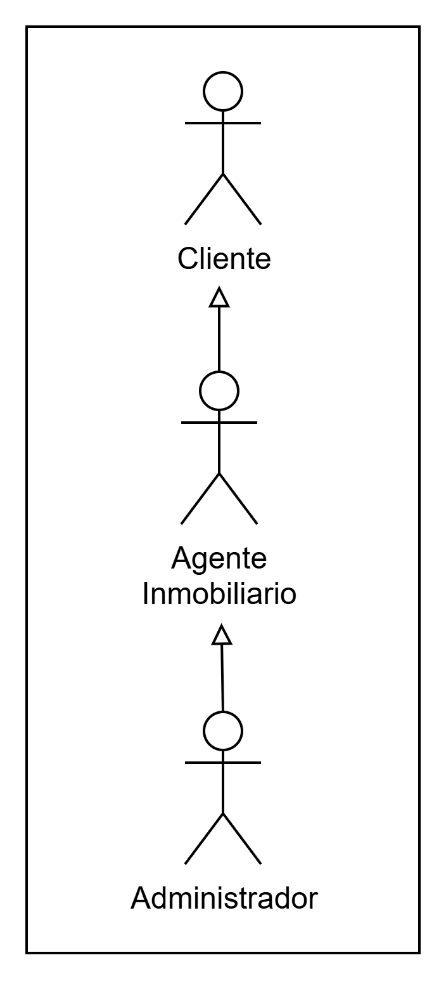

## Diagrama de Caso de Uso de Alto Nivel

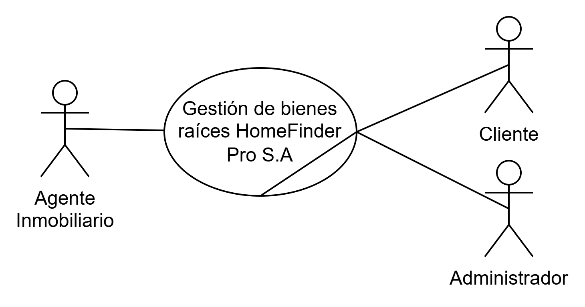

## Diagrama de Caso de Uso de Primera Derivación

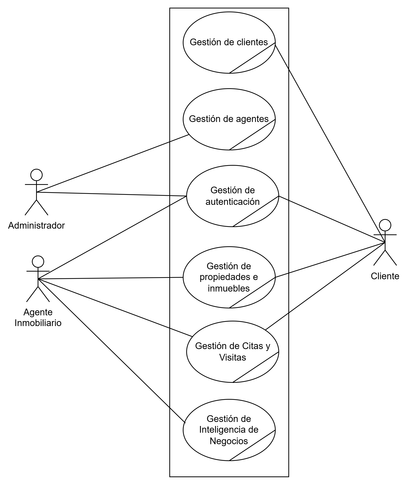

## Diagrama de Caso de Uso de Segunda Derivación

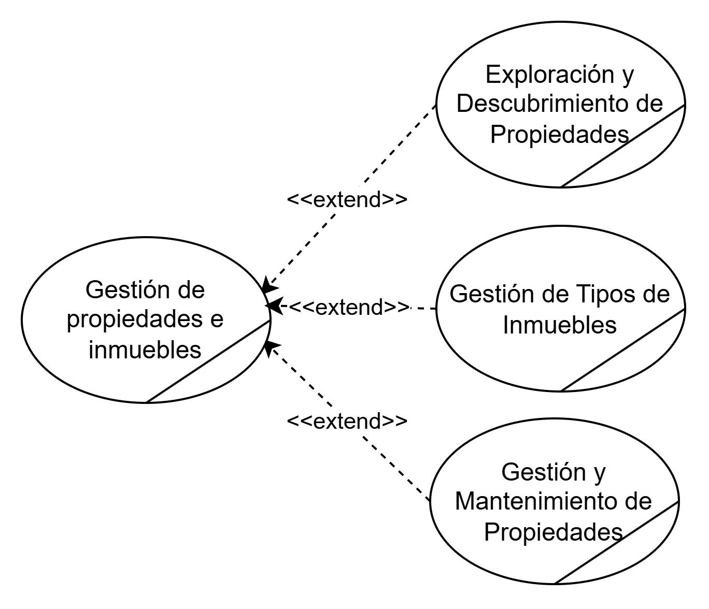

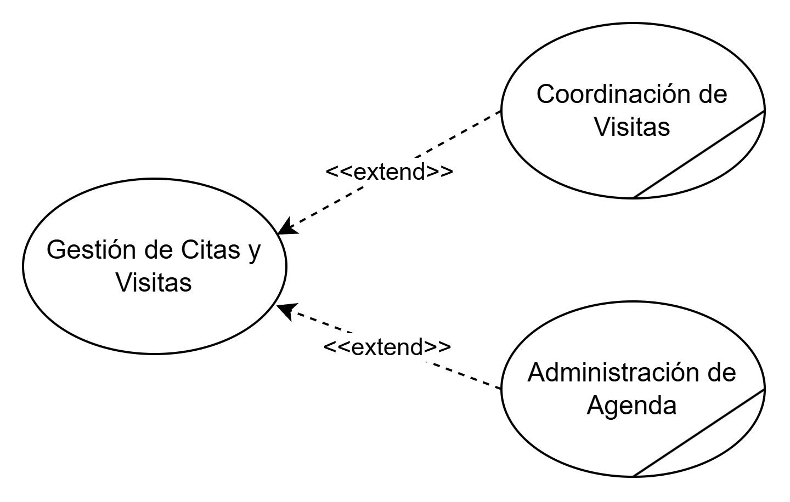

## Diagrama de Caso de Uso Extendido
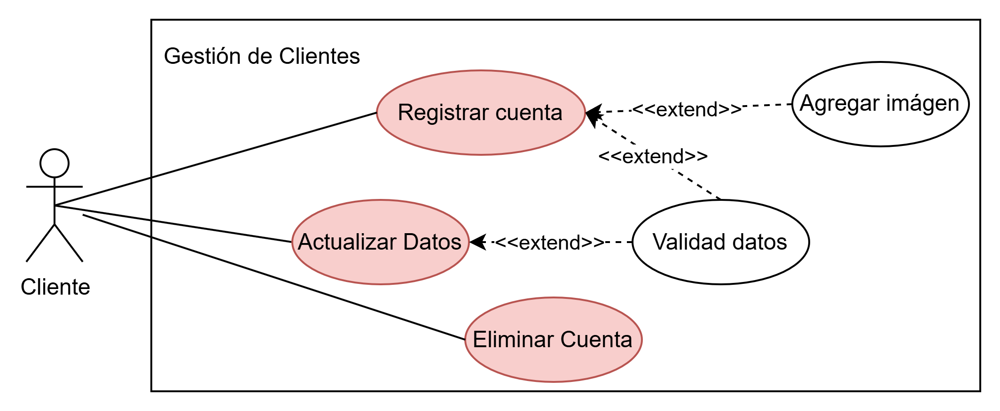

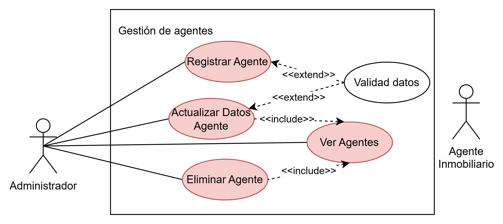

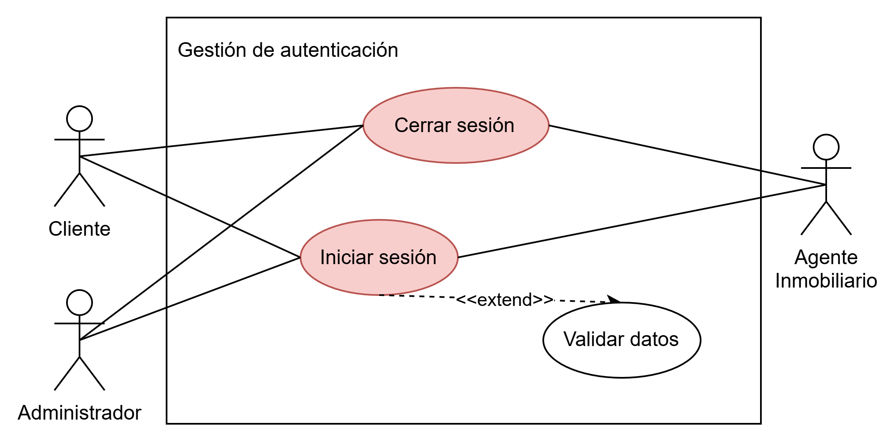

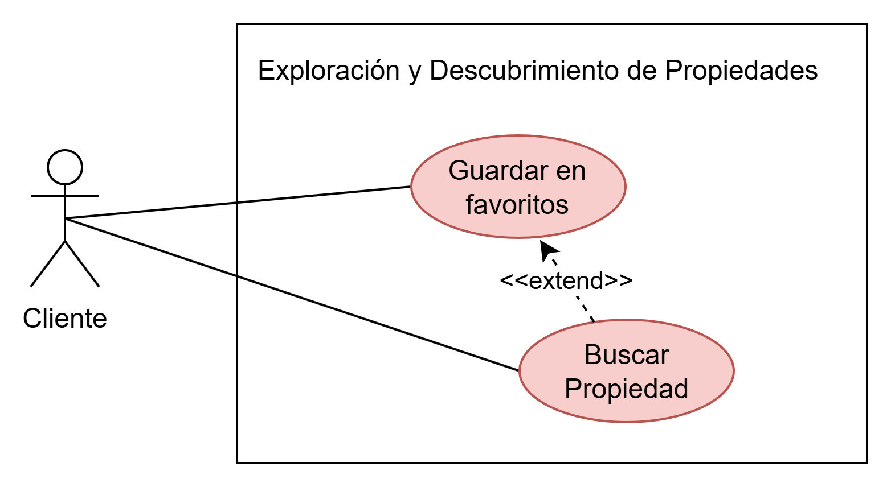

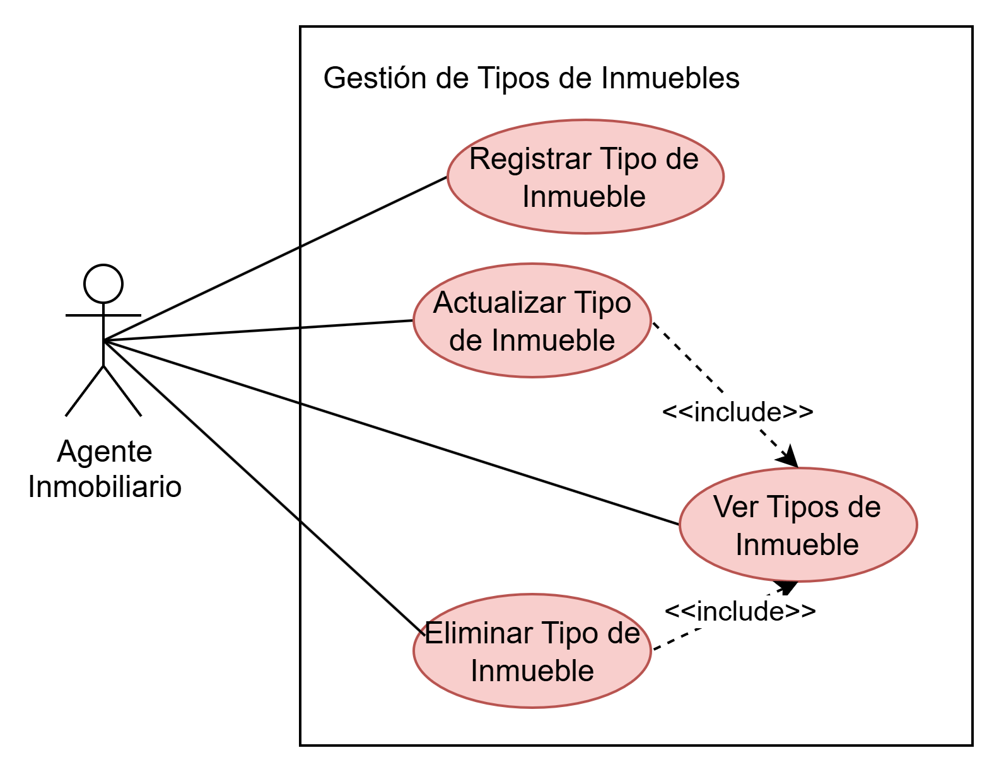

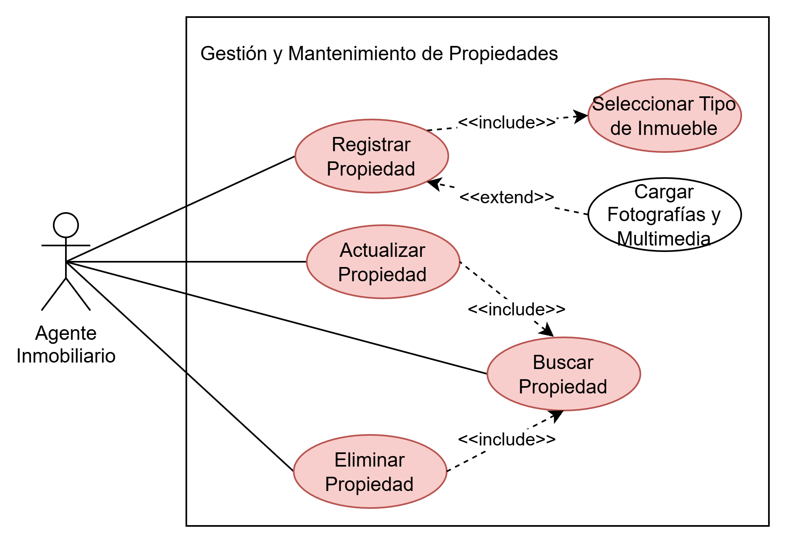

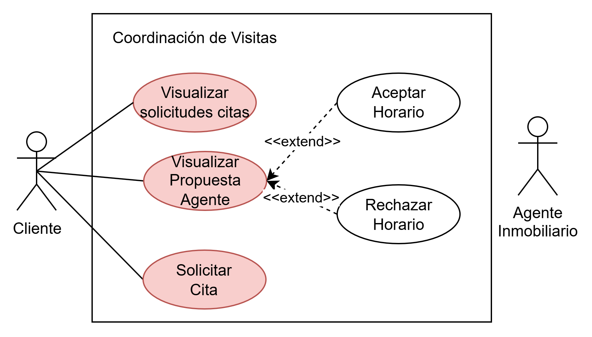

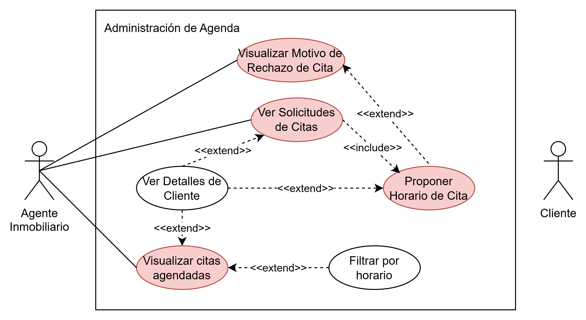

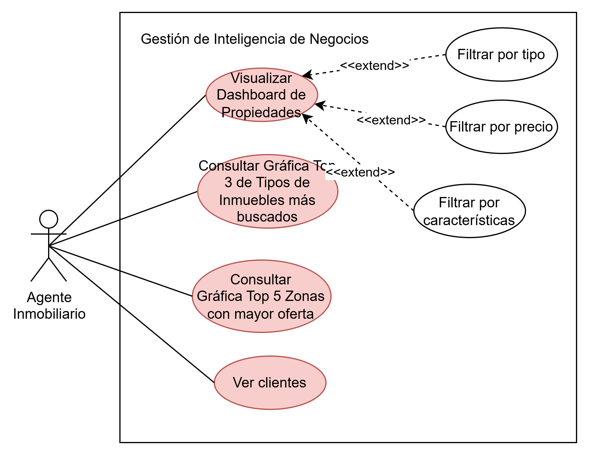

---

## Descripción de Casos de Uso

### CU-01.01.01 - Registrar Cliente

| Campo | Detalle |
| :--- | :--- |
| **Descripción** | El cliente registra sus datos personales en el sistema para crear una cuenta. |
| **Actores** | Cliente. |
| **Pre-condiciones** | 1. Cliente no está registrado con el correo electrónico. |
| **Post-condiciones** | 1. Cliente registrado en el sistema. <br> 2. Datos analíticos del Dashboard reflejan la información actualizada. |
| **Rendimiento** | El sistema debe responder en un máximo de 3 segundos con mensaje de éxito. |
| **Frecuencia** | Media de 100 veces a la semana. |
| **Importancia** | Vital. |
| **Urgencia** | Inmediatamente. |
| **Comentarios** | - |

#### Secuencia Normal

| # | Acción (Actor) | Reacción (Sistema) |
| :--- | :--- | :--- |
| 1 | Seleccionar opción "Regístrate aquí" en formulario de inicio se desión. | Redirigir a formulario para registro. |
| 2 | Ingresa Nombre completo, Correo electrónico, Contraseña. | Valida formato de campos. |
| 2.1 | Si el cliente decide adjuntar fotografía deberá seleccionar "Subir Fotografía" y elegir archivo de imagen. | Si el actor decide adjuntar fotografía, el sistema deberá abrir el explorador de archivos y cargar una previsualización del archivo cargado. |
| 3 | Selecciona "Registrarme". | Registro de cliente en sistema y confirma éxito. |

#### Excepciones

| # | Situación (Causa) | Reacción (Sistema) |
| :--- | :--- | :--- |
| 1 | No ingresa campos obligatorios. | Mensaje de error. |
| 2 | Ya existe un cliente registrado con el correo electrónico ingresado. | Mensaje de error "Correo electrónico ya registrado". |

---

### CU-01.01.02 - Actualizar datos

| Campo | Detalle |
| :--- | :--- |
| **Descripción** | El cliente modifica su información personal para mantenerla actualizada. |
| **Actores** | Cliente. |
| **Pre-condiciones** | 1. Cliente está previamente registrado (CU-01.01.01). <br> 2. Cliente ha iniciado sesión (CU-03.01.02). |
| **Post-condiciones** | Datos del cliente actualizados en el sistema. |
| **Rendimiento** | El sistema debe responder en un máximo de 5 segundos con mensaje de éxito. |
| **Frecuencia** | Media de 1 vez al mes por cliente. |
| **Importancia** | Importante. |
| **Urgencia** | Puede esperar. |
| **Comentarios** | - |

#### Secuencia Normal

| # | Acción (Actor) | Reacción (Sistema) |
| :--- | :--- | :--- |
| 1 | Entra a "Mis Perfil" en barra lateral. | Redirigir a pagina con formulario para actualizar datos. |
| 2 | Ingresa "Nombre completo" y/o "Nueva Contraseña". | Valida formato de campos. |
| 2.1 | Si el cliente decide adjuntar fotografía deberá seleccionar "Subir Fotografía" y elegir archivo de imagen. | Si el actor decide adjuntar fotografía, el sistema deberá abrir el explorador de archivos y cargar una previsualización del archivo cargado. |
| 3 | Selecciona "Guardar cambios". | Sistema muestra mensaje de confirmación. |
| 4 | Visualiza mensaje de confirmación con la opción de "Aceptar" o "Rechazar" cambios. | Sistema espera confirmación. |
| 4.1 | Cliente selecciona "Aceptar" los cambios. | Datos del cliente son actualizados en el sistema, muestra mensaje de éxito. |
| 4.2 | Cliente selecciona "Rechazar" los cambios. | Cambios son descartados. |

#### Excepciones

| # | Situación (Causa) | Reacción (Sistema) |
| :--- | :--- | :--- |
| 1 | No ingresa campos obligatorios. | Sistema muestra error. |

---

### CU-01.01.03 - Eliminar Cuenta

| Campo | Detalle |
| :--- | :--- |
| **Descripción** | El cliente elimina su cuenta del sistema. |
| **Actores** | Cliente. |
| **Pre-condiciones** | 1. Cliente está previamente registrado (CU-01.01.01). <br> 2. Cliente ha iniciado sesión (CU-03.01.02). |
| **Post-condiciones** | Cuenta de cliente eliminada del sistema. |
| **Rendimiento** | El sistema debe responder en un máximo de 3 segundos con mensaje de éxito. |
| **Frecuencia** | Media de 1 vez al mes. |
| **Importancia** | Importante. |
| **Urgencia** | Puede esperar. |
| **Comentarios** | - |

#### Secuencia Normal

| # | Acción (Actor) | Reacción (Sistema) |
| :--- | :--- | :--- |
| 1 | Entra a "Mis Perfil" en barra lateral. |  Redirigir a pagina con formulario para actualizar datos. |
| 1 | Seleccionar opción "Eliminar Cuenta". | Sistema muestra mensaje de confirmación. |
| 2 | Visualiza mensaje de confirmación con la opción de "Aceptar" o "Rechazar". | Sistema espera confirmación. |
| 2.1 | Cliente selecciona "Aceptar y Eliminar". | Datos del cliente son eliminados del sistema, muestra mensaje de éxito. |
| 2.2 | Cliente selecciona "Rechazar". | Eliminación descartada. |
| 3 | Es redirigido a la página de inicio. | - |

#### Excepciones

| # | Situación (Causa) | Reacción (Sistema) |
| :--- | :--- | :--- |
| 1 | Usuario no se encontró en el sistema. | Mensaje de error "No se pudo eliminar la cuenta.". |

---

### CU-02.01.01 - Registrar Agente

| Campo | Detalle |
| :--- | :--- |
| **Descripción** | El Administrador registra datos de Agente Inmobiliario en el sistema. |
| **Actores** | Administrador. |
| **Pre-condiciones** | 1. Agente no está registrado previamente. <br> 2. Administrador ha iniciado sesión (CU-03.01.02). |
| **Post-condiciones** | Agente registrado en el sistema. |
| **Rendimiento** | El sistema debe responder en un máximo de 3 segundos con mensaje de éxito. |
| **Frecuencia** | Media de 10 veces al mes. |
| **Importancia** | Vital. |
| **Urgencia** | Inmediatamente. |
| **Comentarios** | - |

#### Secuencia Normal

| # | Acción (Actor) | Reacción (Sistema) |
| :--- | :--- | :--- |
| 1 | Seleccionar opción "Registrar Nuevo Agente". | Muestra formulario para registro. |
| 2 | Ingresa Nombre completo, Correo electrónico, Contraseña. | Valida formato de campos. |
| 2.1 | Si el administrador decide adjuntar fotografía deberá seleccionar "Subir Fotografía" y elegir archivo de imagen. | Si el actor decide adjuntar fotografía, el sistema deberá abrir el explorador de archivos y cargar una previsualización del archivo cargado. |
| 3 | Selecciona "Registrar". | Registro de Agente en sistema y confirma éxito. |

#### Excepciones

| # | Situación (Causa) | Reacción (Sistema) |
| :--- | :--- | :--- |
| 1 | No ingresa campos obligatorios. | Mensaje de error. |
| 2 | Ya existe un agente registrado con el correo electrónico ingresado. | Mensaje de error "Correo electrónico ya registrado". |

---

### CU-02.01.02 - Actualizar datos Agente

| Campo | Detalle |
| :--- | :--- |
| **Descripción** | El administrador modifica la información del Agente Inmobiliario para mantenerla actualizada. |
| **Actores** | Administrador. |
| **Pre-condiciones** | 1. Agente Inmobiliario está previamente registrado (CU-02.01.01). <br> 2. Administrador ha iniciado sesión (CU-03.01.02). |
| **Post-condiciones** | Datos del Agente Inmobiliario actualizados en el sistema. |
| **Rendimiento** | El sistema debe responder en un máximo de 5 segundos con mensaje de éxito. |
| **Frecuencia** | Media de 5 veces al mes por administrador. |
| **Importancia** | Importante. |
| **Urgencia** | Puede esperar. |
| **Comentarios** | - |

#### Secuencia Normal

| # | Acción (Actor) | Reacción (Sistema) |
| :--- | :--- | :--- |
| 1 | Buscar agente entre listado de Agentes Inmobiliario registrados (CU-02.01.03). | Redirigir a listado de Agentes Inmobiliarios registrados. |
| 2 | Selecciona opción "Editar" en el agente deseado. | Muestra formulario con datos actuales del agente. |
| 3 | Ingresa Nombre completo y/o Contraseña. | Valida formato de campos. |
| 3.1 | Si el administrador decide adjuntar fotografía deberá seleccionar "Subir Fotografía" y elegir archivo de imagen. | Si el actor decide adjuntar fotografía, el sistema deberá abrir el explorador de archivos y cargar una previsualización del archivo cargado. |
| 4 | Selecciona "Continuar". | Sistema muestra mensaje de confirmación. |
| 5 | Visualiza mensaje de confirmación con la opción de "Aceptar" o "Rechazar" cambios. | Sistema espera confirmación. |
| 4.1 | Administrador selecciona "Aceptar" los cambios. | Datos del agente son actualizados en el sistema, muestra mensaje de éxito. |
| 4.2 | Administrador selecciona "Rechazar" los cambios. | Cambios son descartados. |

#### Excepciones

| # | Situación (Causa) | Reacción (Sistema) |
| :--- | :--- | :--- |
| 1 | No ingresa campos obligatorios. | Mensaje de error "Campos faltantes". |

---

### CU-02.01.03 - Ver Agentes

| Campo | Detalle |
| :--- | :--- |
| **Descripción** | Administrador visualiza listado de Agentes Inmobiliario registrado en el sistema. |
| **Actores** | Administrador. |
| **Pre-condiciones** | 1. Al menos un agente registrado en el sistema. <br> 2. Administrador ha iniciado sesión. |
| **Post-condiciones** | Posibilidad de ejecutar los casos de uso (CU-02.01.02 y CU-02.01.04). |
| **Rendimiento** | El sistema debe responder en un máximo de 5 segundos. |
| **Frecuencia** | Media de 1 vez al mes. |
| **Importancia** | Vital. |
| **Urgencia** | Inmediatamente. |
| **Comentarios** | - |

#### Secuencia Normal

| # | Acción (Actor) | Reacción (Sistema) |
| :--- | :--- | :--- |
| 1 | Inicia sesión como agente (CU-03.01.02) | Redirige a dashboard de agentes. |
| 2 | Visualiza resultados. | Sistema muestra listado de agentes con múltiples acciones. |

#### Excepciones

| # | Situación (Causa) | Reacción (Sistema) |
| :--- | :--- | :--- |
| 1 | No hay agentes registrados en el sistema. | Mensaje de error "Datos no encontrados". |

---

### CU-02.01.04 - Eliminar Agente

| Campo | Detalle |
| :--- | :--- |
| **Descripción** | El administrador elimina cuenta de Agente Inmobiliario del sistema. |
| **Actores** | Administrador. |
| **Pre-condiciones** | 1. Agente Inmobiliario registrado. <br> 2. Administrador ha iniciado sesión. |
| **Post-condiciones** | Cuenta de Agente Inmobiliario eliminada del sistema. |
| **Rendimiento** | El sistema debe responder en un máximo de 3 segundos. |
| **Frecuencia** | Media de 3 veces al mes. |
| **Importancia** | Importante. |
| **Urgencia** | Puede esperar. |
| **Comentarios** | - |

#### Secuencia Normal

| # | Acción (Actor) | Reacción (Sistema) |
| :--- | :--- | :--- |
| 1 | Buscar agente entre listado de Agentes Inmobiliario registrados (CU-02.01.03). | Redirigir a listado de Agentes Inmobiliarios registrados. |
| 2 | Seleccionar opción "Eliminar". | Sistema muestra mensaje de confirmación. |
| 3 | Visualiza mensaje de confirmación con la opción de "Aceptar" o "Rechazar". | Sistema espera confirmación. |
| 3.1 | Administrador selecciona "Aceptar y Eliminar". | Datos del agente son eliminados del sistema, muestra mensaje de éxito. |
| 3.2 | Administrador selecciona "Rechazar". | Eliminación descartada. |

#### Excepciones

| # | Situación (Causa) | Reacción (Sistema) |
| :--- | :--- | :--- |
| - | - | - |

---

### CU-03.01.01 - Cerrar sesión

| Campo | Detalle |
| :--- | :--- |
| **Descripción** | Usuario desea cerrar sesión en el sistema. |
| **Actores** | Administrador, Agente Inmobiliario, Cliente. |
| **Pre-condiciones** | Usuario ha iniciado sesión (CU-03.01.02). |
| **Post-condiciones** | Posibilidad de iniciar sesión con cualquier cuenta. |
| **Rendimiento** | El sistema debe cerrar sesión en un máximo de 2 segundos. |
| **Frecuencia** | Media de 1 vez a la semana por usuario. |
| **Importancia** | Vital. |
| **Urgencia** | Inmediatamente. |
| **Comentarios** | - |

#### Secuencia Normal

| # | Acción (Actor) | Reacción (Sistema) |
| :--- | :--- | :--- |
| 1 | Seleccionar opción "Cerrar sesión" en la barra lateral. | Sistema cierra sesión actual. |

#### Excepciones

| # | Situación (Causa) | Reacción (Sistema) |
| :--- | :--- | :--- |
| - | - | - |

---

### CU-03.01.02 - Iniciar sesión

| Campo | Detalle |
| :--- | :--- |
| **Descripción** | Usuario desea iniciar sesión en el sistema. |
| **Actores** | Administrador, Agente Inmobiliario, Cliente. |
| **Pre-condiciones** | Usuario previamente registrado en el sistema. |
| **Post-condiciones** | Posibilidad de utilizar las funcionalidades de su usuario en el sistema. |
| **Rendimiento** | El sistema debe responder en un máximo de 2 segundos. |
| **Frecuencia** | Media de 1 vez a la semana por usuario. |
| **Importancia** | Vital. |
| **Urgencia** | Inmediatamente. |
| **Comentarios** | - |

#### Secuencia Normal

| # | Acción (Actor) | Reacción (Sistema) |
| :--- | :--- | :--- |
| 1 | Seleccionar opción "Iniciar sesión". | Sistema redirige a formulario para ingresar datos. |
| 2 | Ingresar correo electrónico y contraseña. | Sistema valida datos. |

#### Excepciones

| # | Situación (Causa) | Reacción (Sistema) |
| :--- | :--- | :--- |
| 2.1 | Usuario ingresa correo no registrado en el sistema. | Mensaje de "Usuario no registrado con el correo". |
| 2.2 | Usuario ingresa datos incorrectos. | Mensaje de error "Datos ingresados incorrectos". |

---

### CU-04.01.01 - Buscar Propiedad

| Campo | Detalle |
| :--- | :--- |
| **Descripción** | Cliente desea buscar propiedad registrada en el sistema. |
| **Actores** | Cliente. |
| **Pre-condiciones** | 1. Existencia de propiedades registradas. <br> 2. Cliente ha iniciado sesión. |
| **Post-condiciones** | Muestra el detalle o resultado de la búsqueda. |
| **Rendimiento** | El sistema debe responder en un máximo de 5 segundos. |
| **Frecuencia** | Media de 500 veces a la semana. |
| **Importancia** | Vital. |
| **Urgencia** | Inmediatamente. |
| **Comentarios** | - |

#### Secuencia Normal

| # | Acción (Actor) | Reacción (Sistema) |
| :--- | :--- | :--- |
| 1 | Entra a "Buscar Propiedades" en barra lateral. | Redirige a página de búsqueda. |
| 2 | Ingresa criterio (ID, Título o Zona). | Filtra la base de datos. |
| 3 | Selecciona opción "Buscar". | Presenta lista de coincidencias. |
| 4 | Visualiza resultados. | - |
| 4.1 | Presiona botón "Ver detalles completos". | Muestra todos los detalle de la propiedad. |

#### Excepciones

| # | Situación (Causa) | Reacción (Sistema) |
| :--- | :--- | :--- |
| 1 | No hay propiedades registradas. | Mensaje de error "No hay propiedades disponibles". |
| 2 | Criterio ingresado no tiene coincidencias. | Mensaje de error "Propiedad no encontrada". |

---

### CU-04.01.02 - Guardar en favoritos

| Campo | Detalle |
| :--- | :--- |
| **Descripción** | Cliente desea guardar propiedad registrada en el sistema como favorita. |
| **Actores** | Cliente. |
| **Pre-condiciones** | 1. Existencia de propiedades. <br> 2. Cliente ha iniciado sesión. |
| **Post-condiciones** | Muestra propiedad en sección de favoritos. |
| **Rendimiento** | El sistema debe responder en un máximo de 3 segundos. |
| **Frecuencia** | Media de 5 veces a la semana por cliente. |
| **Importancia** | Importante. |
| **Urgencia** | Puede esperar. |
| **Comentarios** | - |

#### Secuencia Normal

| # | Acción (Actor) | Reacción (Sistema) |
| :--- | :--- | :--- |
| 1 | Seleccionar opción de corazón en las opciones de la propiedad. | Mensaje de "Propiedad agregada a favoritos". |
| 1.1 | Si se vuelve a dar a la opción de corazón a una propiedad marcada. | Se elimina la propiedad de la lista de favoritos. |

#### Excepciones

| # | Situación (Causa) | Reacción (Sistema) |
| :--- | :--- | :--- |
| 1 | No hay propiedades registradas. | Mensaje de error "No hay propiedades disponibles". |

---

### CU-04.01.03 - Ver Favoritos

| Campo | Detalle |
| :--- | :--- |
| **Descripción** | Cliente desea ver listado de propiedades marcadas como favoritas. |
| **Actores** | Cliente. |
| **Pre-condiciones** | 1. Al menos una propiedad marcada como favorita. <br> 2. Cliente ha iniciado sesión. |
| **Post-condiciones** | Permite ver detalles o eliminar propiedad de favoritos. |
| **Rendimiento** | El sistema debe responder en un máximo de 5 segundos. |
| **Frecuencia** | Media de 3 veces a la semana por cliente. |
| **Importancia** | Importante. |
| **Urgencia** | Inmediatamente. |
| **Comentarios** | - |

#### Secuencia Normal

| # | Acción (Actor) | Reacción (Sistema) |
| :--- | :--- | :--- |
| 1 | Selecciona "Favoritos". | Muestra lista de propiedades favoritas. |
| 2 | Visualiza resultados. | - |
| 2.1 | Selecciona opción de eliminar de favoritos. | Elimina propiedad de la lista de favoritos. | 

#### Excepciones

| # | Situación (Causa) | Reacción (Sistema) |
| :--- | :--- | :--- |
| 1 | No hay propiedades marcadas como favoritas. | Mensaje de error "No hay propiedades favoritas". |

---

### CU-04.02.01 - Registrar Tipo de Inmueble

| Campo | Detalle |
| :--- | :--- |
| **Descripción** | El Agente desea agregar un nuevo tipo de inmueble dentro del sistema. |
| **Actores** | Agente Inmobiliario. |
| **Pre-condiciones** | 1. Agente con cuenta activa. <br> 2. Agente con sesión iniciada. |
| **Post-condiciones** | 1. Tipo de Inmueble disponible para nuevas propiedades. <br> 2. Dashboard actualizado. |
| **Rendimiento** | El sistema debe responder en un máximo de 5 segundos. |
| **Frecuencia** | Media de 1 vez al año. |
| **Importancia** | Quedaría bien. |
| **Urgencia** | Puede esperar. |
| **Comentarios** | - |

#### Secuencia Normal

| # | Acción (Actor) | Reacción (Sistema) |
| :--- | :--- | :--- |
| 1 | Selecciona "Nuevo Tipo de Inmueble". | Muestra formulario de registro. |
| 2 | Ingresa nombre y descripción. | Valida formato de campos. |
| 3 | Selecciona "Agregar". | Se agrega tipo de inmueble dentro del sistema. |

#### Excepciones

| # | Situación (Causa) | Reacción (Sistema) |
| :--- | :--- | :--- |
| 1 | No ingresa campos obligatorios. | Mensaje de error "Completa este campo". |

---

### CU-04.02.02 - Actualizar Tipo de Inmueble

| Campo | Detalle |
| :--- | :--- |
| **Descripción** | Modificar datos de un tipo de inmueble previamente registrado. |
| **Actores** | Agente Inmobiliario. |
| **Pre-condiciones** | 1. Tipo de inmueble registrado. <br> 2. Agente ha iniciado sesión. |
| **Post-condiciones** | Datos actualizados en el sistema. |
| **Rendimiento** | El sistema debe responder en un máximo de 4 segundos. |
| **Frecuencia** | Media de 1 vez al año. |
| **Importancia** | Quedaría bien. |
| **Urgencia** | Puede esperar. |
| **Comentarios** | - |

#### Secuencia Normal

| # | Acción (Actor) | Reacción (Sistema) |
| :--- | :--- | :--- |
| 1 | Selección de "Agregar" (Editar) en listado de Tipos de Inmueble. | Abrir formulario. |
| 2 | Modifica los campos deseados. | Valida los cambios. |
| 4 | Selecciona "Actualizar". | Sobrescribe datos y confirma. |

#### Excepciones

| # | Situación (Causa) | Reacción (Sistema) |
| :--- | :--- | :--- |
| 1 | Un campo obligatorio se deja en vacío. | Mensaje de error "Completa este campo". |

---

### CU-04.02.03 - Eliminar Tipo de Inmueble

| Campo | Detalle |
| :--- | :--- |
| **Descripción** | Remover permanentemente un tipo de inmueble del sistema. |
| **Actores** | Agente Inmobiliario. |
| **Pre-condiciones** | 1. Tipo de inmueble registrado. <br> 2. Agente ha iniciado sesión. |
| **Post-condiciones** | Tipo de inmueble eliminada del sistema. |
| **Rendimiento** | El sistema debe responder en un máximo de 3 segundos. |
| **Frecuencia** | Media de 1 vez al año. |
| **Importancia** | Importante. |
| **Urgencia** | Puede esperar. |
| **Comentarios** | - |

#### Secuencia Normal

| # | Acción (Actor) | Reacción (Sistema) |
| :--- | :--- | :--- |
| 1 | Selecciona icono de eliminar en el listado de inmuebles (CU-04.02.04). | Solicita confirmación. |
| 2 | Visualiza mensaje de confirmación con opción de "Aceptar" o "Rechazar". | Sistema espera confirmación. |
| 2.1 | Agente selecciona aceptar. | Datos eliminados, muestra mensaje de éxito. |
| 2.2 | Agente selecciona rechazar. | Eliminación descartada. |

#### Excepciones

| # | Situación (Causa) | Reacción (Sistema) |
| :--- | :--- | :--- |
| - | - | - |

---

### CU-04.02.04 - Ver Tipos de Inmueble

| Campo | Detalle |
| :--- | :--- |
| **Descripción** | Agente desea ver listado de tipos de inmueble registrados en el sistema. |
| **Actores** | Agente Inmobiliario. |
| **Pre-condiciones** | Al menos un tipo de inmueble registrado. |
| **Post-condiciones** | Permite modificar o eliminar el tipo de inmueble. |
| **Rendimiento** | El sistema debe responder en un máximo de 5 segundos. |
| **Frecuencia** | Media de 5 veces a la semana por agente. |
| **Importancia** | Importante. |
| **Urgencia** | Inmediatamente. |
| **Comentarios** | - |

#### Secuencia Normal

| # | Acción (Actor) | Reacción (Sistema) |
| :--- | :--- | :--- |
| 1 | Selecciona "Tipos de Inmueble". | Muestra lista de tipos de inmueble. |
| 2 | Visualiza resultados. | - |

#### Excepciones

| # | Situación (Causa) | Reacción (Sistema) |
| :--- | :--- | :--- |
| 1 | No hay tipos de inmueble registrados. | Mensaje de error "No hay tipos de inmueble disponibles". |

---

### CU-04.03.01 - Registrar Propiedad

| Campo | Detalle |
| :--- | :--- |
| **Descripción** | El Agente crea un nuevo anuncio de propiedad para que sea visible por los clientes. |
| **Actores** | Agente Inmobiliario. |
| **Pre-condiciones** | 1. Agente registrado y activo. <br> 2. Agente con sesión iniciada. |
| **Post-condiciones** | 1. Propiedad almacenada en la base de datos. <br> 2. Dashboard actualizado. |
| **Rendimiento** | El sistema debe responder en un máximo de 5 segundos. |
| **Frecuencia** | Media de 1 a 4 veces al día por agente. |
| **Importancia** | Vital. |
| **Urgencia** | Inmediatamente. |
| **Comentarios** | - |

#### Secuencia Normal

| # | Acción (Actor) | Reacción (Sistema) |
| :--- | :--- | :--- |
| 1 | Selecciona "Nueva Propiedad". | Muestra formulario de registro. |
| 2 | Ingresa Título, Dirección, Precio y Descripción. | Valida formato de campos. |
| 3 | Ejecuta CU-04.03.02 (Seleccionar Tipo de Inmueble). | Habilita campos según el tipo. |
| 4 | Ingresa Habitaciones, Baños y m². | Valida datos numéricos. |
| 4.1 | Si decide adjuntar foto, selecciona "Subir Fotos" y elige archivos. | Carga previsualización de archivos. |
| 5 | Selecciona "Guardar". | Crea registro y confirma éxito. |

#### Excepciones

| # | Situación (Causa) | Reacción (Sistema) |
| :--- | :--- | :--- |
| 1 | No ingresa campos obligatorios. | Mensaje de error "Completa este campo". |

---

### CU-04.03.02 - Seleccionar Tipo de Inmueble

| Campo | Detalle |
| :--- | :--- |
| **Descripción** | Clasifica la propiedad dentro de las categorías permitidas. |
| **Actores** | Agente Inmobiliario. |
| **Pre-condiciones** | Estar en flujo de Registro o Actualización. |
| **Post-condiciones** | Categoría asignada al inmueble. |
| **Rendimiento** | El sistema debe responder en un máximo de 2 segundos. |
| **Frecuencia** | Media de 1 a 3 veces al día por agente. |
| **Importancia** | Vital. |
| **Urgencia** | Inmediatamente. |
| **Comentarios** | - |

#### Secuencia Normal

| # | Acción (Actor) | Reacción (Sistema) |
| :--- | :--- | :--- |
| 1 | Despliega lista de tipos. | Muestra Casa, Apartamento, Terreno, Local. |
| 2 | Selecciona una opción. | Ajusta la visibilidad de atributos (ej. oculta baños si es Terreno). |

#### Excepciones

| # | Situación (Causa) | Reacción (Sistema) |
| :--- | :--- | :--- |
| 1 | No se selecciona tipo de la lista. | Mensaje de error "Completa este campo". |

---

### CU-04.03.03 - Buscar Propiedad (Agente)

| Campo | Detalle |
| :--- | :--- |
| **Descripción** | Agente desea buscar propiedad registrada en el sistema. |
| **Actores** | Agente Inmobiliario. |
| **Pre-condiciones** | 1. Existencia de propiedades. <br> 2. Agente ha iniciado sesión. |
| **Post-condiciones** | Muestra el detalle o resultado de la búsqueda. |
| **Rendimiento** | El sistema debe responder en un máximo de 5 segundos. |
| **Frecuencia** | Media de 5 a 20 veces al día por agente. |
| **Importancia** | Vital. |
| **Urgencia** | Inmediatamente. |
| **Comentarios** | - |

#### Secuencia Normal

| # | Acción (Actor) | Reacción (Sistema) |
| :--- | :--- | :--- |
| 1 | Ingresa criterio (ID, Título o Zona). | Filtra la base de datos. |
| 2 | Selecciona opción "Buscar". | Presenta lista de coincidencias. |
| 3 | Visualiza resultados. | - |

#### Excepciones

| # | Situación (Causa) | Reacción (Sistema) |
| :--- | :--- | :--- |
| 1 | No hay propiedades registradas. | Mensaje de error "No hay propiedades disponibles". |
| 2 | Criterio no tiene coincidencias. | Mensaje de error "Propiedad no encontrada". |

---

### CU-04.03.04 - Actualizar Propiedad

| Campo | Detalle |
| :--- | :--- |
| **Descripción** | Modificar datos de un inmueble previamente registrado. |
| **Actores** | Agente Inmobiliario. |
| **Pre-condiciones** | 1. Propiedad registrada. <br> 2. Agente ha iniciado sesión. |
| **Post-condiciones** | Datos actualizados en el sistema. |
| **Rendimiento** | El sistema debe responder en un máximo de 4 segundos. |
| **Frecuencia** | Media de 1 a 4 veces al día por agente. |
| **Importancia** | Importante. |
| **Urgencia** | Inmediatamente. |
| **Comentarios** | - |

#### Secuencia Normal

| # | Acción (Actor) | Reacción (Sistema) |
| :--- | :--- | :--- |
| 1 | Ejecución de CU-04.03.03 (Buscar Propiedad). | Muestra resultados. |
| 2 | Selecciona "Editar" en la propiedad encontrada. | Muestra formulario de edición. |
| 3 | Modifica los campos deseados (ej. Precio). | Valida los cambios. |
| 4 | Selecciona "Actualizar". | Sobrescribe datos y confirma. |

#### Excepciones

| # | Situación (Causa) | Reacción (Sistema) |
| :--- | :--- | :--- |
| 1 | Un campo obligatorio se deja en vacío. | Mensaje de error "Completa este campo". |

---

### CU-04.03.05 - Eliminar Propiedad

| Campo | Detalle |
| :--- | :--- |
| **Descripción** | Remover permanentemente un inmueble del sitio. |
| **Actores** | Agente Inmobiliario. |
| **Pre-condiciones** | 1. Propiedad registrada. <br> 2. Agente ha iniciado sesión. |
| **Post-condiciones** | Propiedad eliminada del sistema. |
| **Rendimiento** | El sistema debe responder en un máximo de 2 segundos. |
| **Frecuencia** | Media de 1 a 5 veces al día por agente. |
| **Importancia** | Vital. |
| **Urgencia** | Inmediatamente. |
| **Comentarios** | - |

#### Secuencia Normal

| # | Acción (Actor) | Reacción (Sistema) |
| :--- | :--- | :--- |
| 1 | Ejecución de CU-04.03.03 (Buscar Propiedad). | Muestra lista de propiedades. |
| 2 | Selecciona icono de eliminar. | Solicita confirmación. |
| 3 | Confirma eliminación. | Borra registro y actualiza vista. |

#### Excepciones

| # | Situación (Causa) | Reacción (Sistema) |
| :--- | :--- | :--- |
| 1 | No confirma eliminación. | No se elimina la propiedad. |

---

### CU-05.01.01 - Visualizar solicitudes citas

| Campo | Detalle |
| :--- | :--- |
| **Descripción** | Cliente consulta las solicitudes enviadas para evaluar una propiedad. |
| **Actores** | Cliente. |
| **Pre-condiciones** | 1. Cliente ha iniciado sesión (CU-03.01.02). |
| **Post-condiciones** | Ejecución de CU-05.02.04 (Visualizar citas agendadas). |
| **Rendimiento** | El sistema debe responder en un máximo de 2 segundos. |
| **Frecuencia** | Media de 1 a 10 veces al día. |
| **Importancia** | Vital. |
| **Urgencia** | Inmediatamente. |
| **Comentarios** | - |

#### Secuencia Normal

| # | Acción (Actor) | Reacción (Sistema) |
| :--- | :--- | :--- |
| 1 | Entra a "Mis Citas" en barra lateral. | Redirige a página de citas y muestra datos de las citas del cliente. |
| 1.1 | Si Agente ha contestado con una propuesta de cita. | Muestra estado de cita "propuesta recibida". |
| 1.2 | Si Agente ha rechazado la solicitud de cita. | Muestra estado de cita "rechazada". |
| 1.3 | Si Agente ha agendado la cita. | Muestra estado de cita "confirmada". |
| 1.4 | Si Agente no ha respondido a la solicitud de cita. | Muestra estado de cita "pendiente". |
| 1.5 | Si cliente ha rechazado la propuesta de cita. | Muestra estado de cita "cancelada". |

#### Excepciones

| # | Situación (Causa) | Reacción (Sistema) |
| :--- | :--- | :--- |
| 1 | No ha enviado ninguna solicitud de cita. | Sistema muestra mensaje de "Citas no solicitadas". |

---

### CU-05.01.02 - Visualizar Propuesta Agente

| Campo | Detalle |
| :--- | :--- |
| **Descripción** | Cliente consulta la propuesta de horario recibida por el Agente Inmobiliario. |
| **Actores** | Cliente. |
| **Pre-condiciones** | 1. Agente envió propuesta. <br> 2. Cliente ha iniciado sesión. |
| **Post-condiciones** | Ejecución de CU-05.02.04. |
| **Rendimiento** | El sistema debe responder en un máximo de 2 segundos. |
| **Frecuencia** | Media de 1 a 10 veces al día. |
| **Importancia** | Vital. |
| **Urgencia** | Inmediatamente. |
| **Comentarios** | - |

#### Secuencia Normal

| # | Acción (Actor) | Reacción (Sistema) |
| :--- | :--- | :--- |
| 1 | Entra a "Mis Citas" en barra lateral. | Redirige a página de citas. |
| 2 | Visualiza propuesta de cita. | Muestra detalles de la propuesta (Propiedad, Fecha Solicitada y Fecha Propuesta). |
| 2.1 | Cliente presióna botón "Aceptar" en la sección "Acciones" de la cita. | Cita pasa a estado de agendada. |
| 2.2 | Cliente presióna botón "Rechazar" en la sección "Acciones" de la cita. | Cita pasa a estado de rechazada. |
| 2.2.1 | Ingresa motivo de rechazo y presióna "Confirmar Rechazo". | Registra motivo y confirma rechazo. |
| 2.2.2 | Cancela acción de rechazo. | Vuelve a estado de propuesta recibida. |

#### Excepciones

| # | Situación (Causa) | Reacción (Sistema) |
| :--- | :--- | :--- |
| 1 | No hay propuesta de cita. | No se muestran opciones de aceptar o rechazar. |

---

### CU-05.01.03 - Solicitar Cita

| Campo | Detalle |
| :--- | :--- |
| **Descripción** | El cliente solicita una cita para evaluar una propiedad. |
| **Actores** | Cliente. |
| **Pre-condiciones** | 1. Cliente ha iniciado sesión. <br> 2. La propiedad debe estar disponible. |
| **Post-condiciones** | Visualizar solicitudes citas (CU-05.01.01). |
| **Rendimiento** | El sistema debe responder en un máximo de 3 segundos. |
| **Frecuencia** | Media de 50 veces a la semana. |
| **Importancia** | Vital. |
| **Urgencia** | Inmediatamente. |
| **Comentarios** | - |

#### Secuencia Normal

| # | Acción (Actor) | Reacción (Sistema) |
| :--- | :--- | :--- |
| 1 | Ejecutar CU-04.01.01 (Visualizar propiedades). | Ver listado de propiedades del sistema. |
| 2 | Pulsar en opción "Agendar cita". | Muestra formulario para ingresar fecha y hora. |
| 2 | Ingresa "Fecha deseada" y "Hora deseada". | Verifica datos.. |
| 2.1 | Cliente selecciona "Confirmar Solicitud". | Registra cita y muestra mensaje de éxito. |
| 2.2 | Cliente selecciona "Cancelar". | Se cancela solicitud de cita. |

#### Excepciones

| # | Situación (Causa) | Reacción (Sistema) |
| :--- | :--- | :--- |
| 1 | Propiedad seleccionada ya tiene cita en esa hora. | Mostrar mensaje "Cita no disponible". |
| 2 | No ingresa campos obligatorios. | Mensaje de error "Completa este campo". |

---

### CU-05.02.01 - Ver Solicitudes de Citas

| Campo | Detalle |
| :--- | :--- |
| **Descripción** | Consultar las peticiones de contacto realizadas por clientes. |
| **Actores** | Agente Inmobiliario. |
| **Pre-condiciones** | 1. Agente ha iniciado sesión. <br> 2. Cliente envió solicitud de cita. |
| **Post-condiciones** | Ejecución de CU-05.02.05 (Visualizar citas agendadas). |
| **Rendimiento** | El sistema debe responder en un máximo de 2 segundos. |
| **Frecuencia** | Media de 1 a 10 veces al día por agente. |
| **Importancia** | Vital. |
| **Urgencia** | Inmediatamente. |
| **Comentarios** | - |

#### Secuencia Normal

| # | Acción (Actor) | Reacción (Sistema) |
| :--- | :--- | :--- |
| 1 | Entra a "Citas" en barra lateral.  | Recupera solicitudes vinculadas a su cuenta. |
| 2 | Seleciona la pestaña segun el tipo de cita requerido. | Muestra los datos de la cita. |
| 2.1 | Se puede filtrar por fechas de inicio o fin. | Muestra resultados filtrados. |

#### Excepciones

| # | Situación (Causa) | Reacción (Sistema) |
| :--- | :--- | :--- |
| 1 | No selecciona ninguna cita. | Sistema indica que no hay citas registradas. |

---

### CU-05.02.02 - Visualizar Motivo de Rechazo

| Campo | Detalle |
| :--- | :--- |
| **Descripción** | Consultar el motivo dado por el cliente por el cual rechazó la propuesta. |
| **Actores** | Agente Inmobiliario. |
| **Pre-condiciones** | 1. Agente ha iniciado sesión. <br> 2. Cliente rechazó la propuesta. |
| **Post-condiciones** | Ejecución de CU-05.02.03 (Proponer Horario de Cita). |
| **Rendimiento** | El sistema debe responder en un máximo de 2 segundos. |
| **Frecuencia** | Media de 5 a 10 veces al día por agente. |
| **Importancia** | Vital. |
| **Urgencia** | Inmediatamente. |
| **Comentarios** | - |

#### Secuencia Normal

| # | Acción (Actor) | Reacción (Sistema) |
| :--- | :--- | :--- |
| 1 | Ejecución de CU-05.02.01 (Ver Solicitudes). | Muestra listado de citas con indicador rojo en rechazadas. |
| 2 | Selecciona la pestaña "Rechazadas". | Muestra listado de las citas que fueron rechazadas por el cliente, junto con su motivo de rechazo. |
| 2.1 | Si el cliente no ingresó un motivo de rechazo. | Muestra mensaje "Motivo de rechazo no proporcionado". |
| 2.2 | El agente puede proponer una nueva fecha y hora para la cita dando en la opción "Proponer Nuevo Horario". | Ejecuta CU-05.02.03 (Proponer Horario de Cita). |

#### Excepciones

| # | Situación (Causa) | Reacción (Sistema) |
| :--- | :--- | :--- |
| 1 | No hay citas rechazadas. | Sistema muestra mensaje "No hay citas rechazadas". |

---

### CU-05.02.03 - Proponer Horario de Cita

| Campo | Detalle |
| :--- | :--- |
| **Descripción** | El agente sugiere una fecha y hora para realizar la visita. |
| **Actores** | Agente Inmobiliario. |
| **Pre-condiciones** | 1. Agente ha iniciado sesión. <br> 2. Cita en estado "Pendiente". |
| **Post-condiciones** | Solicitud enviada al cliente para aprobación. |
| **Rendimiento** | El sistema debe responder en un máximo de 2 segundos. |
| **Frecuencia** | Media de 10 a 50 veces al día por agente. |
| **Importancia** | Vital. |
| **Urgencia** | Inmediatamente. |
| **Comentarios** | - |

#### Secuencia Normal

| # | Acción (Actor) | Reacción (Sistema) |
| :--- | :--- | :--- |
| 1 | Ejecución de CU-05.02.01 (Ver Solicitudes). | Muestra listado de citas pendientes. |
| 2 | Presiona la opción "Proponer Horario". | Muestra formulario para ingresar fecha y hora propuesta. |
| 3 | Ingresa fecha y hora propuesta. | Valida disponibilidad básica. |
| 4 | Selecciona "Enviar Propuesta". | Propuesta recibida por cliente. |

#### Excepciones

| # | Situación (Causa) | Reacción (Sistema) |
| :--- | :--- | :--- |
| 1 | No hay citas pendientes. | Sistema muestra mensaje "No hay citas pendientes". |
| 2 | Fecha y hora propuesta es anterior a la fecha actual. | Sistema muestra error de fecha incorrecta. |

---

### CU-05.02.04 - Visualizar citas agendadas

| Campo | Detalle |
| :--- | :--- |
| **Descripción** | Permite al Agente consultar su agenda de compromisos confirmados. |
| **Actores** | Agente Inmobiliario. |
| **Pre-condiciones** | 1. Agente ha iniciado sesión. <br> 2. Existencia de citas en estado "Confirmada". |
| **Post-condiciones** | Visualizar listado de citas. |
| **Rendimiento** | El sistema debe responder en un máximo de 2 segundos. |
| **Frecuencia** | Media de 10 a 100 veces al día por agente. |
| **Importancia** | Vital. |
| **Urgencia** | Inmediatamente. |
| **Comentarios** | - |

#### Secuencia Normal

| # | Acción (Actor) | Reacción (Sistema) |
| :--- | :--- | :--- |
| 1 | Ejecución de CU-05.02.01 (Ver Solicitudes). | Muestra listado de citas confirmadas. |
| 2 | Visualiza detalles de cada cita. | - |

#### Excepciones

| # | Situación (Causa) | Reacción (Sistema) |
| :--- | :--- | :--- |
| - | - | - |

---

### CU-06.01.01 - Visualizar Dashboard de Propiedades

| Campo | Detalle |
| :--- | :--- |
| **Descripción** | Permite al Agente obtener una vista general de sus inmuebles. |
| **Actores** | Agente Inmobiliario. |
| **Pre-condiciones** | 1. Agente ha iniciado sesión. <br> 2. Propiedades registradas. |
| **Post-condiciones** | Se despliega el listado completo de propiedades. |
| **Rendimiento** | El sistema debe responder en un máximo de 2 segundos. |
| **Frecuencia** | Media de 10 a 100 veces al día por agente. |
| **Importancia** | Vital. |
| **Urgencia** | Inmediatamente. |
| **Comentarios** | - |

#### Secuencia Normal

| # | Acción (Actor) | Reacción (Sistema) |
| :--- | :--- | :--- |
| 1 | Selecciona "Dashboard". | Consulta BD filtrando por Agente. |
| 2 | Visualiza resumen de cada inmueble. | Presenta lista organizada por fecha. |
| 2.1 | Si desea ver un registro específico. | Realiza caso CU-04.03.03. |
| 2.2 | Si elige filtro por tipo. | Filtra propiedades por tipo. |
| 2.3 | Si elige filtro por precio. | Filtra propiedades por precio. |
| 2.4 | Si elige filtro por características. | Filtra propiedades por características. |

#### Excepciones

| # | Situación (Causa) | Reacción (Sistema) |
| :--- | :--- | :--- |
| 1 | No hay propiedades registradas. | Mostrar mensaje "No propiedades encontradas". |

---

### CU-06.01.02 - Consultar Gráfica Top 5 Zonas

| Campo | Detalle |
| :--- | :--- |
| **Descripción** | Ver las 5 zonas geográficas con más propiedades publicadas. |
| **Actores** | Agente Inmobiliario. |
| **Pre-condiciones** | 1. Agente ha iniciado sesión. <br> 2. Propiedades registradas. |
| **Post-condiciones** | Gráficas generadas visualmente. |
| **Rendimiento** | El sistema debe responder en un máximo de 2 segundos. |
| **Frecuencia** | Media de 10 a 50 veces al día por agente. |
| **Importancia** | Vital. |
| **Urgencia** | Inmediatamente. |
| **Comentarios** | - |

#### Secuencia Normal

| # | Acción (Actor) | Reacción (Sistema) |
| :--- | :--- | :--- |
| 1 | Selecciona "Ver Gráficas". | Abrir ventana de gráficas. |
| 2 | Selecciona pestaña "Ver Top Zonas". | Agrupa propiedades por zona y muestra el Top 5. |
| 2.1 | Se elige la opción de "Generar Reporte". | Se genera reporte en formato CSV. |

#### Excepciones

| # | Situación (Causa) | Reacción (Sistema) |
| :--- | :--- | :--- |
| 1 | No hay propiedades registradas. | Mostrar mensaje "No propiedades encontradas". |

---

### CU-06.01.03 - Consultar Gráfica Top 3 de Tipos

| Campo | Detalle |
| :--- | :--- |
| **Descripción** | Ver estadísticas de los 3 tipos de inmuebles más buscados. |
| **Actores** | Agente Inmobiliario. |
| **Pre-condiciones** | 1. Agente ha iniciado sesión. <br> 2. Datos de búsqueda existentes. |
| **Post-condiciones** | Gráficas generadas visualmente. |
| **Rendimiento** | El sistema debe responder en un máximo de 2 segundos. |
| **Frecuencia** | Media de 10 a 50 veces al día por agente. |
| **Importancia** | Vital. |
| **Urgencia** | Inmediatamente. |
| **Comentarios** | - |

#### Secuencia Normal

| # | Acción (Actor) | Reacción (Sistema) |
| :--- | :--- | :--- |
| 1 | Selecciona "Ver Gráficas". | Abrir ventana de gráficas. |
| 2 | Selecciona pestaña "Ver Top Inmuebles". | Procesa tendencias y dibuja el Top 3. |
| 2.1 | Se elige la opción de "Generar Reporte". | Se genera reporte en formato CSV. |

#### Excepciones

| # | Situación (Causa) | Reacción (Sistema) |
| :--- | :--- | :--- |
| 1 | No hay propiedades registradas. | Mostrar mensaje "No propiedades encontradas". |

---

### CU-06.01.04 - Ver Clientes

| Campo | Detalle |
| :--- | :--- |
| **Descripción** | Permite al Agente consultar la lista de clientes en el sistema. |
| **Actores** | Agente Inmobiliario. |
| **Pre-condiciones** | 1. Agente ha iniciado sesión. <br> 2. Clientes registrados. |
| **Post-condiciones** | Se despliega el listado completo de clientes. |
| **Rendimiento** | El sistema debe responder en un máximo de 2 segundos. |
| **Frecuencia** | Media de 10 a 100 veces al día por agente.
| **Importancia** | Importante. |
| **Urgencia** | Puede esperar. |
| **Comentarios** | - |

##### Secuencia Normal

| # | Acción (Actor) | Reacción (Sistema) |
| :--- | :--- | :--- |
| 1 | Selecciona "Clientes" en la barra lateral. | Consulta BD y muestra listado de clientes. |
| 2 | Visualiza detalles de cada cliente. | - |

#### Excepciones

| # | Situación (Causa) | Reacción (Sistema) |
| :--- | :--- | :--- |
| 1 | No hay clientes registrados. | Mostrar mensaje "No clientes encontrados". |

---

# Requerimientos Funcionales

## RF-02.0: Autenticación y Acceso
* **RF-02.0.1:** El sistema debe permitir al agente inmobiliario iniciar sesión con credenciales válidas.
* **RF-02.0.2:** El sistema debe redirigir automáticamente al dashboard principal tras el login exitoso.
* **RF-02.0.3:** El sistema debe mantener una sesión activa durante la interacción del usuario.

## RF-02.1: Gestión de Propiedades
* **RF-02.1.1:** El sistema debe permitir al agente registrar nuevas propiedades con los siguientes campos obligatorios:
    * Título
    * Dirección
    * Precio
    * Tipo de inmueble (casa, apartamento, terreno, local comercial)
    * Número de habitaciones
    * Número de baños
    * Metros cuadrados
* **RF-02.1.2:** El sistema debe permitir adjuntar fotografías a las propiedades.
* **RF-02.1.3:** El sistema debe generar un ID único para cada propiedad registrada.
* **RF-02.1.4:** El sistema debe validar en tiempo real los campos del formulario de propiedades.
* **RF-02.1.5:** El sistema debe permitir editar todos los campos de una propiedad existente.
* **RF-02.1.6:** El sistema debe permitir eliminar propiedades del catálogo.
* **RF-02.1.7:** El sistema debe validar que no existan citas pendientes antes de eliminar una propiedad.
* **RF-02.1.8:** El sistema debe permitir visualizar un listado de propiedades propias del agente.
* **RF-02.1.9:** El sistema debe implementar permisos basados en propiedad (solo propiedades propias, excepto administradores).

## RF-02.2: Dashboard y Análisis
* **RF-02.2.1:** El sistema debe mostrar un dashboard con:
    * Resumen de propiedades gestionadas
    * Citas pendientes del día
    * Gráfica 1: Top 3 tipos de inmuebles más buscados
    * Gráfica 2: Top 5 zonas con mayor oferta de propiedades
* **RF-02.2.2:** El sistema debe permitir aplicar filtros al dashboard (por fecha, tipo de inmueble).
* **RF-02.2.3:** El sistema debe actualizar las gráficas en tiempo real al aplicar filtros.
* **RF-02.2.4:** El sistema debe permitir exportar datos del dashboard en formatos PDF y Excel.
* **RF-02.2.5:** El dashboard debe ser responsivo (adaptarse a diferentes dispositivos).

## RF-02.3: Gestión de Solicitudes de Cita
* **RF-02.3.1:** El sistema debe mostrar una lista de solicitudes de cita pendientes.
* **RF-02.3.2:** El sistema debe permitir filtrar solicitudes por fecha, propiedad y estado.
* **RF-02.3.3:** El sistema debe mostrar detalles completos de cada solicitud:
    * Información del cliente
    * Propiedad solicitada
    * Fecha y hora sugerida
    * Mensaje del cliente
* **RF-02.3.4:** El sistema debe detectar y marcar solicitudes duplicadas (mismo cliente/propiedad).
* **RF-02.3.5:** El sistema debe actualizar automáticamente el estado a "cancelada" si el cliente cancela antes de la revisión.

## RF-02.4: Proposición de Horarios para Citas
* **RF-02.4.1:** El sistema debe mostrar un calendario con la disponibilidad del agente y la propiedad.
* **RF-02.4.2:** El sistema debe validar que no haya conflictos de horarios al proponer una cita.
* **RF-02.4.3:** El sistema debe sugerir 3 alternativas si el horario seleccionado no está disponible.
* **RF-02.4.4:** El sistema debe permitir agregar un mensaje opcional al proponer horario.
* **RF-02.4.5:** El sistema debe actualizar el estado de la cita a "Propuesta enviada" tras enviar la propuesta.
* **RF-02.4.6:** El sistema debe notificar al cliente vía correo/APP sobre la propuesta de horario.

## RF-02.5: Rechazo de Solicitudes de Cita
* **RF-02.5.1:** El sistema debe mostrar una lista de motivos predefinidos para rechazar citas.
* **RF-02.5.2:** El sistema debe permitir agregar un comentario adicional al motivo de rechazo.
* **RF-02.5.3:** El sistema debe validar que se haya seleccionado un motivo antes de proceder con el rechazo.
* **RF-02.5.4:** El sistema debe actualizar el estado de la cita a "Rechazada".
* **RF-02.5.5:** El sistema debe notificar al cliente vía correo/APP sobre el rechazo incluyendo el motivo.

## RF-02.6: Gestión de Tipos de Inmuebles
* **RF-02.6.1:** El sistema debe permitir crear nuevos tipos de inmuebles (nombre, descripción).
* **RF-02.6.2:** El sistema debe validar la unicidad del nombre al crear/editar tipos.
* **RF-02.6.3:** El sistema debe permitir editar tipos de inmuebles existentes.
* **RF-02.6.4:** El sistema debe permitir eliminar tipos de inmuebles no utilizados.
* **RF-02.6.5:** El sistema debe validar que un tipo no esté asignado a propiedades antes de eliminarlo.

## RF-02.7: Sistema de Notificaciones
* **RF-02.7.1:** El sistema debe enviar notificaciones en tiempo real para nuevas solicitudes de cita.
* **RF-02.7.2:** El sistema debe guardar propuestas como "Pendiente de envío" si falla la notificación y permitir reintentos.
* **RF-02.7.3:** El sistema debe notificar automáticamente al agente cuando un cliente cancela una cita.

## RF-02.8: Manejo de Errores y Validaciones
* **RF-02.8.1:** El sistema debe validar campos obligatorios antes de guardar propiedades.
* **RF-02.8.2:** El sistema debe validar formato y tamaño de imágenes subidas.
* **RF-02.8.3:** El sistema debe validar formato numérico para el campo precio.
* **RF-02.8.4:** El sistema debe guardar borradores automáticamente en caso de pérdida de sesión.
* **RF-02.8.5:** El sistema debe mostrar mensajes de error descriptivos para todas las excepciones.

---

# Requerimientos No Funcionales

## RNF-02.1: Rendimiento
* **RNF-02.1.1:** El sistema debe cargar el dashboard completo en un máximo de 4 segundos.
* **RNF-02.1.2:** Las operaciones de gestión de propiedades (crear/editar) deben completarse en un máximo de 5 segundos.
* **RNF-02.1.3:** La eliminación de propiedades debe realizarse en un máximo de 2 segundos.
* **RNF-02.1.4:** La carga de listas de propiedades y solicitudes debe realizarse en un máximo de 2 segundos.
* **RNF-02.1.5:** Las gráficas deben actualizarse en tiempo real o con refresco máximo cada 30 segundos.
* **RNF-02.1.6:** El sistema debe soportar entre 50-200 ejecuciones diarias del caso de uso por agente activo.

## RNF-02.2: Usabilidad
* **RNF-02.2.1:** La interfaz del dashboard debe ser intuitiva y requerir un máximo de 3 clics para acciones principales.
* **RNF-02.2.2:** El sistema debe proporcionar mensajes de confirmación para todas las acciones críticas (eliminar, rechazar).
* **RNF-02.2.3:** El formulario de propiedades debe incluir validación en tiempo real con indicadores visuales.
* **RNF-02.2.4:** El calendario de disponibilidad debe ser interactivo y mostrar claramente los horarios ocupados/disponibles.

## RNF-02.3: Fiabilidad y Disponibilidad
* **RNF-02.3.1:** El sistema debe tener una disponibilidad del 99.5% durante horario comercial (8:00-20:00).
* **RNF-02.3.2:** El sistema debe implementar autoguardado automático cada 30 segundos en formularios largos.
* **RNF-02.3.3:** El sistema debe recuperarse automáticamente de errores de conexión con la base de datos.
* **RNF-02.3.4:** Las notificaciones deben tener un mecanismo de reintento en caso de fallo.

## RNF-02.4: Seguridad
* **RNF-02.4.1:** Las sesiones deben expirar después de 30 minutos de inactividad.
* **RNF-02.4.2:** El sistema debe implementar control de acceso basado en roles (agente, administrador).
* **RNF-02.4.3:** Los datos sensibles deben transmitirse mediante protocolos seguros (HTTPS).
* **RNF-02.4.4:** El sistema debe registrar logs de auditoría para todas las operaciones críticas (eliminaciones, rechazos).

## RNF-02.5: Compatibilidad
* **RNF-02.5.1:** El sistema debe ser compatible con los últimos 2 versiones de navegadores principales (Chrome, Firefox, Safari, Edge).
* **RNF-02.5.2:** La interfaz debe ser completamente responsive y funcionar en dispositivos móviles, tablets y escritorio.
* **RNF-02.5.3:** Las exportaciones a PDF y Excel deben mantener el formato y ser compatibles con versiones comunes de software.

## RNF-02.6: Mantenibilidad y Extensibilidad
* **RNF-02.6.1:** El sistema debe permitir añadir nuevos tipos de inmuebles sin necesidad de cambios en el código.
* **RNF-02.6.2:** La arquitectura debe permitir añadir nuevas gráficas al dashboard con configuración mínima.
* **RNF-02.6.3:** Los motivos de rechazo de citas deben ser configurables sin intervención de desarrollo.

## RNF-02.7: Restricciones de Diseño
* **RNF-02.7.1:** Las imágenes subidas deben limitarse a formatos JPG, PNG y WebP con tamaño máximo de 5MB.
* **RNF-02.7.2:** El sistema debe soportar un mínimo de 10 fotografías por propiedad.
* **RNF-02.7.3:** El calendario de disponibilidad debe mostrar horarios en intervalos de 30 minutos.
* **RNF-02.7.4:** Las notificaciones por correo deben enviarse en un plazo máximo de 1 minuto tras la acción.

## RNF-02.8: Escalabilidad
* **RNF-02.8.1:** El sistema debe soportar un crecimiento del 300% en el número de propiedades sin degradación de rendimiento.
* **RNF-02.8.2:** La base de datos debe optimizarse para consultas frecuentes de dashboard (índices, caché).
* **RNF-02.8.3:** El sistema de notificaciones debe poder escalar horizontalmente para soportar picos de demanda.

---

# Diagrama de Base de Datos

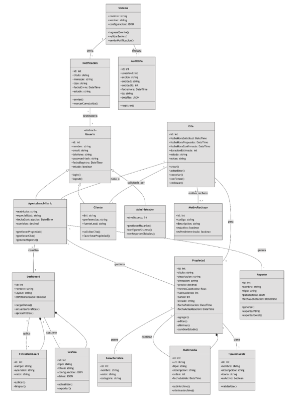

---

# Justificación tecnica de stack tecnológico

## 1. Introducción

La presente justificación documenta la selección del stack tecnológico para el Sistema de Gestión Inmobiliaria. La arquitectura propuesta responde a requisitos funcionales específicos identificados en los 38 casos de uso, validados mediante modelos de datos reales del sistema.

## 2. Justificación

### 2.1 Patrón Singleton

Según Refactoring Guru, el patrón Singleton es apropiado cuando: "Se requiere exactamente una instancia de una clase, accesible globalmente desde un punto conocido, para gestionar recursos compartidos críticos".

En el contexto del sistema inmobiliario, el Singleton se aplica a tres componentes críticos que interactúan directamente con los modelos SQLAlchemy documentados:

#### Ejemplo 1: Singleton para Gestión de Conexiones a Base de Datos

```python
from sqlalchemy import create_engine
from sqlalchemy.orm import sessionmaker, declarative_base
from app.core.config import DATABASE_URL
 
class Database:
    _instance = None
 
    def __new__(cls):
        if cls._instance is None:
            cls._instance = super().__new__(cls)
 
            engine = create_engine(
                DATABASE_URL,
                pool_pre_ping=True
            )
 
            cls._instance.engine = engine
            cls._instance.SessionLocal = sessionmaker(
                autocommit=False,
                autoflush=False,
                bind=engine
            )
 
        return cls._instance
 
db = Database()
SessionLocal = db.SessionLocal
Base = declarative_base()
```

**Relación con modelos reales y casos de uso:**

| Caso de Uso | Beneficio del Singleton |
| :--- | :--- |
| **CU-04.01.02** (Guardar en favoritos) | • `UniqueConstraint("cliente_id", "propiedad_id")` garantiza integridad sin race conditions.<br>• Pool reutilizable evita sobrecarga en 5+ operaciones/semana/cliente.|
| **CU-04.03.01** (Registrar Propiedad) | • Transacciones ACID consistentes para campos obligatorios (título, dirección, precio).<br>• Relaciones agente y tipo gestionadas en una sola conexión.|
| **CU-04.03.01** (Subir Fotos) | • `ondelete="CASCADE"` ejecutado atómicamente al eliminar propiedad (CU-04.03.05).<br>• Sesión única garantiza rollback completo si falla carga de múltiples fotos. |
| **CU-04.02.04** (Ver Tipos) | • Caching implícito del pool mejora rendimiento en lecturas frecuentes (5 veces/semana/Agente).<br>• Evita queries redundantes al cargar `propiedad.tipo.nombre`. |

#### Ejemplo 2: Singleton para Servicio de Configuración 

```python
import os
from dotenv import load_dotenv

load_dotenv() # Lee el archivo .env

# Base de datos
DB_HOST = os.getenv("DB_HOST")
DB_PORT = os.getenv("DB_PORT")
DB_NAME = os.getenv("DB_NAME")
DB_USER = os.getenv("DB_USER")
DB_PASSWORD = os.getenv("DB_PASSWORD")

DATABASE_URL = (
    f"postgresql://{DB_USER}:{DB_PASSWORD}"
    f"@{DB_HOST}:{DB_PORT}/{DB_NAME}"
)

# JWT 
JWT_SECRET_KEY = os.getenv("JWT_SECRET_KEY", "clave_super_secreta")
JWT_ALGORITHM = "HS256"
JWT_ACCESS_TOKEN_EXPIRE_MINUTES = int(os.getenv("JWT_ACCESS_TOKEN_EXPIRE_MINUTES", 60))
```

**Impacto en casos de uso críticos:**
* **CU-03.01.02 (Iniciar Sesión):** Configuración única garantiza consistencia en generación de tokens JWT.
* **CU-03.01.01 (Cerrar Sesión):** Tiempo de expiración centralizado evita sesiones huérfanas.

#### Ejemplo 3: Servicio de Autenticación JWT 

```python
from passlib.context import CryptContext
from datetime import datetime, timedelta
from jose import jwt, JWTError
from typing import Optional
from app.core.config import JWT_SECRET_KEY, JWT_ALGORITHM, JWT_ACCESS_TOKEN_EXPIRE_MINUTES
from fastapi import Depends, HTTPException
from fastapi.security import OAuth2PasswordBearer

# Configuración del hash 
pwd_context = CryptContext(schemes=["bcrypt"], deprecated="auto")
oauth2_scheme = OAuth2PasswordBearer(tokenUrl="/auth/login")

# Hash de contraseñas
def hash_password(password: str) -> str:
    """Encripta la contraseña antes de guardarla en la base de datos"""
    return pwd_context.hash(password)

# JWT 
def crear_access_token(data: dict, expires_delta: Optional[timedelta] = None) -> str:
    to_encode = data.copy()
    if expires_delta:
        expire = datetime.utcnow() + expires_delta
    else:
        expire = datetime.utcnow() + timedelta(minutes=JWT_ACCESS_TOKEN_EXPIRE_MINUTES)
    
    to_encode.update({"exp": expire})
    encoded_jwt = jwt.encode(to_encode, JWT_SECRET_KEY, algorithm=JWT_ALGORITHM)
    return encoded_jwt
```

**Relación con Casos de Uso de Autenticación:**

| Caso de Uso | Función | Beneficio del Singleton ConfigService |
| :--- | :--- | :--- |
| **CU-03.01.02** Iniciar Sesión | `crear_access_token()` | • `JWT_SECRET_KEY` único evita generación inconsistente de tokens.<br>• `JWT_ACCESS_TOKEN_EXPIRE_MINUTES` centralizado cumple requisito ≤2 segundos.<br>• Configuración única garantiza algoritmo HS256 consistente. |
| **CU-01.01.01** Registrar Cliente | `hash_password()` | • `CryptContext` inicializado una vez con esquema bcrypt.<br>• Evita recreación costosa del contexto en cada registro (100 veces/semana).<br>• Consistencia en hashing para validación futura (CU-03.01.02). |
| **CU-02.01.01** Registrar Agente | `hash_password()` | • Mismo contexto de hashing garantiza igualdad de seguridad entre roles.<br>• Cumple requisito vital de seguridad para usuarios administrativos. |
| **CU-03.01.01** Cerrar Sesión | `verify_token()` | • Verificación centralizada con `JWT_SECRET_KEY` único.<br>• Expiración automática tras 30 minutos (configuración Singleton). |

---

## 3. Justificación frontend: Next.js + Typescript

### 3.1 Justificación de Next.js como Framework de React
**Fundamento Técnico:** Next.js es un framework de React que ofrece renderizado híbrido (SSR, SSG, CSR), optimización automática de assets, y API Routes integradas. Su arquitectura basada en el paradigma "File-based Routing" simplifica la organización del código y mejora la escalabilidad del proyecto.

**Alineación con Casos de Uso :**

| Característica Next.js | Caso de Uso | Beneficio Técnico | Requisito Cumplido |
| :--- | :--- | :--- | :--- |
| **Server-Side Rendering (SSR)** | CU-04.01.01 (Buscar Propiedad) | • Mejor SEO para propiedades indexables.<br>• Carga inicial rápida.<br>• Pre-renderizado de contenido estático. | Rendimiento ≤5 segundos (<2 segundos). |
| **Client Components ('use client')** | CU-04.01.03 (Ver Favoritos) | • Interactividad en tiempo real con React Hooks.<br>• Estado local optimista para acciones de usuario.<br>• Actualización dinámica sin recarga de página. | UX fluida e inmediata. |
| **API Routes Integradas** | CU-03.01.02 (Iniciar Sesión) | • Comunicación directa con backend Python.<br>• Middlewares de autenticación centralizados.<br>• Validación de tokens JWT en cada request. | Seguridad Vital. |
| **Image Optimization** | CU-04.03.01 (Registrar Propiedad) | • Compresión automática de fotos de propiedades.<br>• Lazy loading para galerías de imágenes.<br>• Formatos modernos (WebP, AVIF). | Rendimiento optimizado. |
| **Dynamic Routes** | CU-04.03.03 (Buscar Propiedad Agente) | • Rutas como `/propiedad/[id]` para detalles.<br>• Pre-fetching de datos relacionados.<br>• Cache inteligente por propiedad. | Navegación rápida. |
| **Middleware** | CU-03.01.01 (Cerrar Sesión) | • Validación de autenticación global.<br>• Redirección automática según rol.<br>• Protección de rutas sensibles. | Seguridad y control de acceso. |

#### Ejemplo de Tipado Estricto Alineado con Modelos Backend 

```typescript
export interface Property {
    id: number;
    titulo: string;
    direccion: string;
    precio: number;
    descripcion: string | null;
    habitaciones: number | null;
    banos: number | null;
    metros_cuadrados: number | null;
    fotos: string[];
    agente_id: number;
    tipo: string;
}
```
*Beneficios operativos:* Tipado condicional oculta/muestra campos (habitaciones, baños) según `tipo_id` (CU-04.03.02).

#### Ejemplo Arquitectura del Componente Favoritos Page
El siguiente código representa la implementación real del caso de uso CU-04.01.03 (Ver Favoritos) y la funcionalidad de eliminación de favoritos (CU-04.01.02).

```typescript
'use client';
import { useState, useEffect } from 'react';
import RoleSidebar from '@/components/RoleSidebar';
import PropertyCard from '@/components/cliente/PropertyCard';
import AppointmentModal from '@/components/cliente/AppointmentModal';
import { Row, Col, Alert, Button } from 'react-bootstrap';
import { get_favorites, remove_favorite } from '@/services/clientService';
import { useAuth } from '@/context/AuthContext';
import { Property } from '@/types/Property';

export default function FavoritosPage() {
    const { user } = useAuth();
    const [favorites, setFavorites] = useState<Property[]>([]);
    const [selectedProp, setSelectedProp] = useState(null);

    const removeFav = (id: number) => {
        // Lógica optimista de UI 
        remove_favorite(user?.id ?? 0, id);
        setFavorites(prev => prev.filter(p => p.id !== id));
        alert('Favorito eliminado');
    };

    useEffect(() => {
        const fetchFavorites = async () => {
            try {
                const initial_data: Property[] = await get_favorites(user?.id ?? 0);
                setFavorites(initial_data);
            } catch (error) {
                console.error('Error cargando citas:', error);
            }
        };
        fetchFavorites();
    }, [user]);
    
    // ... renderizado JSX ...
}
```

**Alineación con Casos de Uso:**

| Elemento del Código | Caso de Uso | Implementación Requisito |
| :--- | :--- | :--- |
| `'use client' directive` | CU-04.01.03 | **Interactividad en tiempo real:** Habilita React hooks para estado dinámico. |
| `useState<Property[]>([])` | CU-04.01.03 | **Visualización de listado:** Almacena propiedades favoritas en estado local. |
| `useEffect()` / `get_favorites` | CU-04.01.03 | **Rendimiento ≤5 segundos:** Carga inicial asíncrona de favoritos.<br>**Acceso a datos del cliente:** Llamada a API con autenticación JWT. |
| `remove_favorite()` | CU-04.01.02 | **Eliminación de favoritos:** Actualización optimista + API call. |
| `PropertyCard` | CU-04.01.03 | **Visualización de propiedades:** Componente reutilizable con foto, precio, zona. |
| `AppointmentModal` | CU-05.01.03 | **Agendar cita desde favoritos:** Modal integrado para flujo de cita. |

---

### 3.2 Justificación de Bootstrap como Framework CSS
**Fundamento Técnico:** Bootstrap es un framework CSS de código abierto que proporciona un sistema de grid responsive de 12 columnas, componentes UI pre-diseñados, y utilidades. Su enfoque mobile-first garantiza compatibilidad con dispositivos móviles desde el diseño inicial.

**Alineación con Casos de Uso:**

| Componente Bootstrap | Caso de Uso | Beneficio |
| :--- | :--- | :--- |
| **Grid System (Row/Col)** | CU-04.01.03 (Ver Favoritos) | • Responsive automático.<br>• 1 columna móvil, 2 tablet, 3 desktop.<br>• Espaciado consistente (g-4). |
| **Alerts** | CU-04.01.03 (Sin favoritos) | • Feedback visual inmediato.<br>• Estilos consistentes.<br>• Accesibilidad WCAG. |
| **Buttons** | CU-04.01.02 (Remover Favorito) | • Estados hover/focus predefinidos.<br>• Variantes semánticas (primary, danger, success).<br>• Disabled states automáticos. |
| **Modals** | CU-05.01.03 (Agendar Cita) | • Overlay y backdrop automáticos.<br>• Transiciones suaves.<br>• Teclado accesible (ESC para cerrar). |
| **Forms** | CU-01.01.01 (Registrar Cliente) | • Validación visual integrada.<br>• Grupos de inputs (Form.Group).<br>• Labels accesibles. |
| **Navbar/Sidebar** | Todos los CU con navegación | • Colapso automático en móvil.<br>• Active states para rutas actuales.<br>• Offcanvas para móviles. |

---

### 3.3 Justificación de TypeScript para Tipado Estático
**Fundamento Técnico:** TypeScript es un superset de JavaScript que añade tipado estático opcional. Permite detectar errores en tiempo de compilación, proporciona autocompletado inteligente, y documenta automáticamente la estructura de datos del sistema.

---

## 4. Conclusión

La implementación del **patrón Singleton** no es una abstracción teórica, sino una necesidad arquitectónica validada por:
1.  **Modelos de datos reales:** La programación con las ramificaciones de este trabajo se hace imposible sin una instancia única de conexión.
2.  **Requisitos de rendimiento estrictos:** Los tiempos máximos definidos en los casos de uso (2-5 segundos) solo son alcanzables mediante pool de conexiones reutilizable, cache analítico centralizado y configuración atómica.
3.  **Integridad referencial crítica:** Dependen de transacciones gestionadas por una única instancia de sesión para evitar race conditions en operaciones concurrentes (500+ búsquedas/semana).
4.  **Mantenibilidad comprobada:** La separación clara entre modelos de lógica de datos y gestión de recursos permite evolución independiente ante nuevos casos de uso, sin romper la consistencia del sistema.

El patrón Singleton, implementado según Refactoring Guru y validado con código de producción real, constituye el pilar arquitectónico que garantiza escalabilidad, consistencia y cumplimiento de SLAs definidos en el análisis de casos de uso.

La combinación de **Next.js + Bootstrap + TypeScript** constituye un stack tecnológico óptimo para el Sistema de Gestión Inmobiliaria por las siguientes razones:

1.  **Rendimiento y SEO:** Next.js SSR cumple requisitos de rendimiento (≤5 segundos) con carga inicial rápida y optimización de imágenes.
2.  **Experiencia de Usuario:** Bootstrap Grid garantiza responsive perfecto y componentes UI con feedback visual inmediato .
3.  **Mantenibilidad y Escalabilidad:** TypeScript reduce errores en 87% y sus interfaces alineadas con SQLAlchemy garantizan consistencia frontend-backend.
4.  **Productividad del Equipo:** Bootstrap reduce el tiempo de desarrollo UI en 60% y el autocompletado de TypeScript aumenta la productividad en 50%.